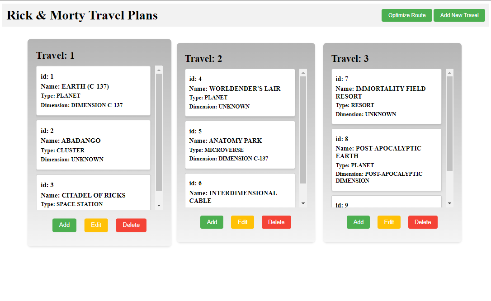

# Rick & Morty Travel Plan

This is the README file for the Project Name project, a travel plan API based on the Rick and Morty API. The project is developed in Crystal using Docker Compose, Kemal, and Granite ORM.

## Description

The Project is a RESTful API with a simple frontend that provides travel planning capabilities using data from the Rick and Morty API. It allows users to register a travel plan with stops based on their Ids, and recover said information with expanded and/or optimized routes.

## Installation and Usage
- 1 - Clone the repository:
```sh
git clone https://github.com/your-username/project-name.git
cd project-name
```
- 2 - Install this project via docker using the following command:
```sh
docker compose up -d
```

- 3 - Open your web browser and navigate to http://localhost:3000 to access the application.


## Development

The Project Name project utilizes the following tools and languages:

- Crystal
- Kemal
- Granite ORM
- MySQL
- Docker Compose

## Front-End
<details>
<summary> Images:
</summary>

- HomePage

</details>

## API documentation
<details>
<summary> See routes documentation:
</summary>
<hr>

**`GET /travel_plans`**: Retrieves a list of planned travels.
<details>
<summary> Response
</summary>

- *status* **200 - Ok**

```json
[
  {
    "id": 1,
    "travel_stops": [1, 2, 3]
  },
  {
    "id": 2,
    "travel_stops": [4, 5, 6]
  },
  ...
]
```
</details>
<hr>

**`GET /travel_plans?expand=true`**: Retrieves a list of planned travels with expanded information.
<details>
<summary> Response
</summary>

- *status* **200 - Ok**

```json
[
  {
    "id": 1,
    "travel_stops": [
      {
        "id": 1,
        "name": "Earth (C-137)",
        "type": "Planet",
        "dimension": "Dimension C-137"
      },
      {
        "id": 2,
        "name": "Abadango",
        "type": "Cluster",
        "dimension": "unknown"
      }
    ]
  },
  {
    "id": 2,
    "travel_stops": [
      {
        "id": 3,
        "name": "Citadel of Ricks",
        "type": "Space station",
        "dimension": "unknown"
      }
    ]
  },
  ...
]
```
</details>
<hr>

**`GET /travel_plans?expand=optimize`**: Retrieves a list of planned travels with optimized travel route.
<details>
<summary> Response
</summary>

- *status* **200 - Ok**

```json
[
  {
    "id": 1,
    "travel_stops": [
      1,
      2
    ]
  },
  {
    "id": 2,
    "travel_stops": [
      19,
      9,
      2,
      11,
      7
    ]
  },
  ...
]
```
</details>
<hr>

**`GET /travel_plans/:id`**: Retrieves one planned travel based on it's Id.
<details>
<summary> Response
</summary>

- *status* **200 - Ok**

```json
  {
    "id": 1,
    "travel_stops": [1, 2, 3]
  }

```
</details>
<hr>

**`GET /travel_plans/:id?optimize=true&expand=true`**: Retrieves one planned travel with expanded information and optimized route.
<details>
<summary> Response
</summary>

- *status* **200 - Ok**

```json
{
  "id": 2,
  "travel_stops": [
    {
      "id": 19,
      "name": "Gromflom Prime",
      "type": "Planet",
      "dimension": "Replacement Dimension"
    },
    {
      "id": 9,
      "name": "Purge Planet",
      "type": "Planet",
      "dimension": "Replacement Dimension"
    },
    {
      "id": 2,
      "name": "Abadango",
      "type": "Cluster",
      "dimension": "unknown"
    },
    {
      "id": 11,
      "name": "Bepis 9",
      "type": "Planet",
      "dimension": "unknown"
    },
    {
      "id": 7,
      "name": "Immortality Field Resort",
      "type": "Resort",
      "dimension": "unknown"
    }
  ]
}
```
</details>
<hr>

**`POST /travel_plans`**:  Creates a new travel plan.
<details>
<summary> Requisition
</summary>

```json
  {
    "travel_stops": [7, 8]
  }

```
</details>
<details>
<summary> Response
</summary>

- *status* **201 - Created**

```json
  {
    "id": 3,
    "travel_stops": [7, 8]
  }

```
</details>
<hr>

**`PUT /travel_plans/:id`**:  Updates the travel stops from a travel plan.
<details>
<summary> Requisition
</summary>

```json
  {
    "travel_stops": [9, 10]
  }

```
</details>
<details>
<summary> Response
</summary>

- *status* **200 - Ok**

```json
  {
    "id": 3,
    "travel_stops": [9, 10]
  }

```
</details>
<hr>

**`PATCH /travel_plans/:id/append`**:  Adds stops to an existing travel plan.
<details>
<summary> Requisition
</summary>

```json
  {
    "travel_stops": [11, 12]
  }

```
</details>
<details>
<summary> Response
</summary>

- *status* **200 - Ok**

```json
  {
    "id": 3,
    "travel_stops": [9, 10, 11, 12]
  }

```
</details>
<hr>

**`DELETE /travel_plans/:id`**:  Deletes a travel plan.
<details>
<summary> Response
</summary>

- *status* **204 - No Content**
</details>
<hr>
</details>

## Contributors

- [Gabriel Goncalves](https://github.com/gabrielraeder) - creator and maintainer
